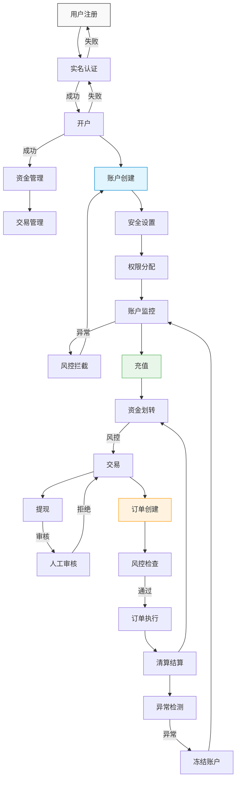

# 核心业务主流程

## 1. 整体业务流程

## 2. 流程说明

### 2.1 用户接入层
1. **用户注册**
   - 基础信息注册
   - 邮箱/手机验证
   - 设置登录密码

2. **实名认证**
   - 身份信息验证
   - 人脸识别
   - KYC审核

3. **开户流程**
   - 选择账户类型
   - 风险评估
   - 开通相应权限

### 2.2 账户管理层
1. **账户创建**
   - 创建主账户
   - 创建子账户
   - 初始化账户配置

2. **安全设置**
   - 交易密码设置
   - 2FA绑定
   - 设备绑定

3. **权限分配**
   - 交易权限
   - 提现权限
   - API权限

4. **账户监控**
   - 登录行为监控
   - 交易行为监控
   - 资金变动监控

### 2.3 资金管理层
1. **充值管理**
   - 多币种支持
   - 充值地址管理
   - 到账确认

2. **资金划转**
   - 账户间划转
   - 币种兑换
   - 手续费处理

3. **交易管理**
   - 订单管理
   - 持仓管理
   - 保证金管理

4. **提现管理**
   - 提现验证
   - 风控审核
   - 链上处理

### 2.4 交易管理层
1. **订单处理**
   - 订单验证
   - 风控检查
   - 订单匹配

2. **清算结算**
   - 实时清算
   - 定时结算
   - 对账处理

3. **异常处理**
   - 异常检测
   - 风控拦截
   - 应急处理

## 3. 关键节点

### 3.1 风控节点
- 注册风控
- 实名风控
- 交易风控
- 提现风控

### 3.2 审核节点
- KYC审核
- 大额提现审核
- 异常交易审核
- 风控审核

### 3.3 监控节点
- 账户安全监控
- 交易行为监控
- 资金异动监控
- 系统性能监控

## 4. 注意事项
1. **安全性**
   - 多重身份验证
   - 加密传输
   - 敏感信息保护

2. **合规性**
   - KYC/AML要求
   - 监管报告
   - 审计日志

3. **可用性**
   - 高可用设计
   - 故障转移
   - 容灾备份

4. **扩展性**
   - 模块化设计
   - 接口标准化
   - 水平扩展支持