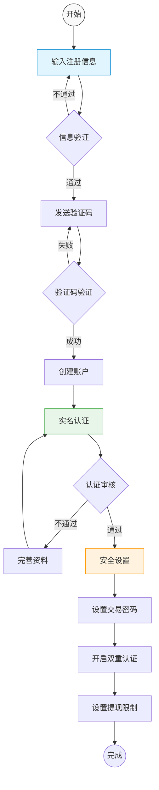

# 用户注册流程

## 1. 注册流程图


## 2. 注册步骤说明

### 2.1 基础信息注册
1. **信息输入**
   - 用户名（唯一性检查）
   - 邮箱地址（格式验证）
   - 手机号码（格式验证）
   - 登录密码（强度要求）
   - 邀请码（可选）

2. **验证码验证**
   - 邮箱验证码
   - 手机验证码
   - 图形验证码
   - Google reCAPTCHA

3. **账户创建**
   - 生成用户ID
   - 创建默认钱包
   - 初始化用户配置
   - 生成API密钥对

### 2.2 实名认证
1. **身份信息**
   - 真实姓名
   - 证件类型
   - 证件号码
   - 证件有效期

2. **身份验证**
   - 人脸识别
   - 证件OCR识别
   - 活体检测
   - 第三方认证

3. **认证审核**
   - 自动审核
   - 人工审核
   - 风控审核
   - 黑名单检查

### 2.3 安全设置
1. **交易密码**
   - 区别于登录密码
   - 强度要求
   - 定期更新提醒
   - 错误次数限制

2. **双重认证**
   - Google验证器
   - 手机验证码
   - 邮箱验证码
   - 硬件密钥（可选）

3. **提现设置**
   - 提现地址白名单
   - 24小时提现限额
   - 大额提现审核
   - 风控规则设置

## 3. 安全措施

### 3.1 注册安全
- IP地址限制
- 设备指纹识别
- 注册频率控制
- 异常行为检测

### 3.2 身份安全
- 多重身份验证
- 实名信息加密
- 证件照片加密
- 敏感信息脱敏

### 3.3 账户安全
- 登录密码加密
- 交易密码加密
- 2FA强制开启
- 安全等级评估

## 4. 风控措施

### 4.1 注册风控
- 批量注册检测
- 代理IP检测
- 设备黑名单
- 关联账号检测

### 4.2 认证风控
- 证件有效性验证
- 人脸比对分析
- 多账号关联检测
- 高风险用户标记

### 4.3 操作风控
- 异地登录检测
- 异常操作检测
- 账户异动监控
- 安全评分系统

## 5. 注意事项
1. **合规要求**
   - 遵守KYC规范
   - 满足AML要求
   - 符合数据保护法规
   - 保留审计日志

2. **用户体验**
   - 简化注册流程
   - 清晰的引导说明
   - 及时的状态反馈
   - 多语言支持

3. **系统性能**
   - 注册并发处理
   - 验证码发送限制
   - 图片上传优化
   - 响应时间控制

## 6. 数据库表设计

### 6.1 用户表
```sql
CREATE TABLE `users` (
    `id` BIGINT UNSIGNED NOT NULL AUTO_INCREMENT COMMENT '自增主键',
    `uid` VARCHAR(32) NOT NULL COMMENT '用户唯一标识',
    `username` VARCHAR(32) NOT NULL COMMENT '用户名',
    `email` VARCHAR(128) NOT NULL COMMENT '邮箱',
    `phone` VARCHAR(20) NOT NULL COMMENT '手机号',
    `password` VARCHAR(128) NOT NULL COMMENT '登录密码(加密)',
    `trade_password` VARCHAR(128) DEFAULT NULL COMMENT '交易密码(加密)',
    `invite_code` VARCHAR(32) DEFAULT NULL COMMENT '邀请码',
    `status` TINYINT NOT NULL DEFAULT 1 COMMENT '状态:0=禁用,1=启用,2=锁定',
    `security_level` TINYINT NOT NULL DEFAULT 0 COMMENT '安全等级:0-5',
    `register_ip` VARCHAR(64) NOT NULL COMMENT '注册IP',
    `register_device` VARCHAR(256) NOT NULL COMMENT '注册设备指纹',
    `last_login_time` DATETIME DEFAULT NULL COMMENT '最后登录时间',
    `last_login_ip` VARCHAR(64) DEFAULT NULL COMMENT '最后登录IP',
    `created_at` DATETIME NOT NULL DEFAULT CURRENT_TIMESTAMP,
    `updated_at` DATETIME NOT NULL DEFAULT CURRENT_TIMESTAMP ON UPDATE CURRENT_TIMESTAMP,
    `avatar_base64` TEXT DEFAULT NULL COMMENT '用户头像base64数据',
    `avatar_thumb_base64` TEXT DEFAULT NULL COMMENT '用户头像缩略图base64数据',
    `avatar_status` TINYINT NOT NULL DEFAULT 0 COMMENT '头像状态:0=未设置,1=待审核,2=已通过,3=已拒绝',
    PRIMARY KEY (`id`),
    UNIQUE KEY `uk_uid` (`uid`),
    UNIQUE KEY `uk_username` (`username`),
    UNIQUE KEY `uk_email` (`email`),
    UNIQUE KEY `uk_phone` (`phone`)
) ENGINE=InnoDB DEFAULT CHARSET=utf8mb4 COMMENT='用户表';
```

### 6.2 用户KYC表
```sql
CREATE TABLE `user_kyc` (
    `id` BIGINT UNSIGNED NOT NULL AUTO_INCREMENT COMMENT '自增主键',
    `uid` VARCHAR(32) NOT NULL COMMENT '用户唯一标识',
    `real_name` VARCHAR(64) NOT NULL COMMENT '真实姓名',
    `id_type` TINYINT NOT NULL COMMENT '证件类型:1=身份证,2=护照',
    `id_number` VARCHAR(64) NOT NULL COMMENT '证件号码(加密)',
    `id_expired_at` DATE NOT NULL COMMENT '证件有效期',
    `front_photo` VARCHAR(256) NOT NULL COMMENT '证件正面照片',
    `back_photo` VARCHAR(256) NOT NULL COMMENT '证件背面照片',
    `face_photo` VARCHAR(256) NOT NULL COMMENT '人脸照片',
    `verify_status` TINYINT NOT NULL DEFAULT 0 COMMENT '认证状态:0=未认证,1=审核中,2=已认证,3=已拒绝',
    `verify_time` DATETIME DEFAULT NULL COMMENT '认证通过时间',
    `verify_operator` VARCHAR(32) DEFAULT NULL COMMENT '审核人员',
    `verify_remark` VARCHAR(256) DEFAULT NULL COMMENT '审核备注',
    `risk_level` TINYINT NOT NULL DEFAULT 0 COMMENT '风险等级:0=正常,1=关注,2=可疑,3=高风险',
    `created_at` DATETIME NOT NULL DEFAULT CURRENT_TIMESTAMP,
    `updated_at` DATETIME NOT NULL DEFAULT CURRENT_TIMESTAMP ON UPDATE CURRENT_TIMESTAMP,
    PRIMARY KEY (`id`),
    UNIQUE KEY `uk_uid` (`uid`),
    KEY `idx_id_number` (`id_number`),
    KEY `idx_verify_status` (`verify_status`)
) ENGINE=InnoDB DEFAULT CHARSET=utf8mb4 COMMENT='用户KYC表';
```

### 6.3 用户安全表
```sql
CREATE TABLE `user_security` (
    `id` BIGINT UNSIGNED NOT NULL AUTO_INCREMENT COMMENT '自增主键',
    `uid` VARCHAR(32) NOT NULL COMMENT '用户唯一标识',
    `google_key` VARCHAR(32) DEFAULT NULL COMMENT 'Google验证器密钥',
    `google_status` TINYINT NOT NULL DEFAULT 0 COMMENT 'Google验证器状态',
    `sms_status` TINYINT NOT NULL DEFAULT 1 COMMENT '短信验证状态',
    `email_status` TINYINT NOT NULL DEFAULT 1 COMMENT '邮件验证状态',
    `withdraw_whitelist` TINYINT NOT NULL DEFAULT 0 COMMENT '提现白名单状态',
    `withdraw_limit` DECIMAL(20,8) NOT NULL DEFAULT 0 COMMENT '提现限额',
    `api_key_limit` INT NOT NULL DEFAULT 5 COMMENT 'API密钥数量限制',
    `login_verify` VARCHAR(32) NOT NULL DEFAULT 'sms,email' COMMENT '登录验证方式',
    `trade_verify` VARCHAR(32) NOT NULL DEFAULT 'sms,google' COMMENT '交易验证方式',
    `withdraw_verify` VARCHAR(32) NOT NULL DEFAULT 'sms,google,email' COMMENT '提现验证方式',
    `created_at` DATETIME NOT NULL DEFAULT CURRENT_TIMESTAMP,
    `updated_at` DATETIME NOT NULL DEFAULT CURRENT_TIMESTAMP ON UPDATE CURRENT_TIMESTAMP,
    PRIMARY KEY (`id`),
    UNIQUE KEY `uk_uid` (`uid`)
) ENGINE=InnoDB DEFAULT CHARSET=utf8mb4 COMMENT='用户安全表';
```

### 6.4 用户设备表
```sql
CREATE TABLE `user_devices` (
    `id` BIGINT UNSIGNED NOT NULL AUTO_INCREMENT COMMENT '自增主键',
    `uid` VARCHAR(32) NOT NULL COMMENT '用户唯一标识',
    `device_id` VARCHAR(64) NOT NULL COMMENT '设备ID',
    `device_type` VARCHAR(32) NOT NULL COMMENT '设备类型:web,ios,android',
    `device_info` JSON NOT NULL COMMENT '设备信息',
    `status` TINYINT NOT NULL DEFAULT 1 COMMENT '状态:0=禁用,1=启用',
    `is_trusted` TINYINT NOT NULL DEFAULT 0 COMMENT '是否可信设备',
    `last_login_time` DATETIME DEFAULT NULL COMMENT '最后登录时间',
    `last_login_ip` VARCHAR(64) DEFAULT NULL COMMENT '最后登录IP',
    `created_at` DATETIME NOT NULL DEFAULT CURRENT_TIMESTAMP,
    PRIMARY KEY (`id`),
    UNIQUE KEY `uk_device_uid` (`device_id`, `uid`),
    KEY `idx_uid` (`uid`)
) ENGINE=InnoDB DEFAULT CHARSET=utf8mb4 COMMENT='用户设备表';
```

### 6.5 用户日志表
```sql
CREATE TABLE `user_logs` (
    `id` BIGINT UNSIGNED NOT NULL AUTO_INCREMENT COMMENT '自增主键',
    `log_id` VARCHAR(64) NOT NULL COMMENT '日志唯一标识',
    `uid` VARCHAR(32) NOT NULL COMMENT '用户唯一标识',
    `device_id` VARCHAR(64) DEFAULT NULL COMMENT '设备ID',
    `log_type` VARCHAR(32) NOT NULL COMMENT '日志类型:login,trade,security',
    `action` VARCHAR(32) NOT NULL COMMENT '操作类型',
    `status` TINYINT NOT NULL COMMENT '状态:0=失败,1=成功',
    `ip_address` VARCHAR(64) NOT NULL COMMENT 'IP地址',
    `location` VARCHAR(128) DEFAULT NULL COMMENT '地理位置',
    `detail` JSON DEFAULT NULL COMMENT '详细信息',
    `created_at` DATETIME NOT NULL DEFAULT CURRENT_TIMESTAMP,
    PRIMARY KEY (`id`),
    UNIQUE KEY `uk_log_id` (`log_id`),
    KEY `idx_uid` (`uid`),
    KEY `idx_device_id` (`device_id`),
    KEY `idx_created_at` (`created_at`)
) ENGINE=InnoDB DEFAULT CHARSET=utf8mb4 COMMENT='用户日志表';
```

### 6.6 表设计说明

1. **非主键关联设计**
   - 使用uid作为用户唯一标识
   - 避免使用自增ID作为关联字段
   - 便于分库分表和数据迁移

2. **数据冗余**
   - 适当冗余关键信息
   - 减少跨表查询
   - 提高查询效率

3. **字段优化**
   - 使用JSON存储复杂数据
   - 合理设置字段长度
   - 选择合适的字段类型

4. **索引设计**
   - 基于uid的查询优化
   - 基于业务场景的索引
   - 避免过多索引

5. **安全性**
   - 敏感信息加密
   - 关键操作记录
   - 设备信息追踪

6. **可扩展性**
   - 预留状态字段
   - 使用JSON存储扩展信息
   - 支持业务扩展

### 6.7 头像相关表设计

1. **用户头像审核记录表**
```sql
CREATE TABLE `user_avatar_reviews` (
    `id` BIGINT UNSIGNED NOT NULL AUTO_INCREMENT COMMENT '自增主键',
    `uid` VARCHAR(32) NOT NULL COMMENT '用户唯一标识',
    `avatar_base64` TEXT NOT NULL COMMENT '头像base64数据',
    `avatar_hash` VARCHAR(64) NOT NULL COMMENT '头像数据哈希',
    `file_size` INT NOT NULL COMMENT '原始大小(字节)',
    `file_type` VARCHAR(32) NOT NULL COMMENT '文件类型(MIME)',
    `image_width` INT NOT NULL COMMENT '图片宽度',
    `image_height` INT NOT NULL COMMENT '图片高度',
    `review_status` TINYINT NOT NULL DEFAULT 0 COMMENT '审核状态:0=待审核,1=已通过,2=已拒绝',
    `reject_reason` VARCHAR(256) DEFAULT NULL COMMENT '拒绝原因',
    `review_time` DATETIME DEFAULT NULL COMMENT '审核时间',
    `review_operator` VARCHAR(32) DEFAULT NULL COMMENT '审核人员',
    `created_at` DATETIME NOT NULL DEFAULT CURRENT_TIMESTAMP,
    `updated_at` DATETIME NOT NULL DEFAULT CURRENT_TIMESTAMP ON UPDATE CURRENT_TIMESTAMP,
    PRIMARY KEY (`id`),
    KEY `idx_uid` (`uid`),
    KEY `idx_review_status` (`review_status`),
    KEY `idx_created_at` (`created_at`)
) ENGINE=InnoDB DEFAULT CHARSET=utf8mb4 COMMENT='用户头像审核记录表';
```

2. **头像处理任务表**
```sql
CREATE TABLE `user_avatar_tasks` (
    `id` BIGINT UNSIGNED NOT NULL AUTO_INCREMENT COMMENT '自增主键',
    `uid` VARCHAR(32) NOT NULL COMMENT '用户唯一标识',
    `source_base64` TEXT NOT NULL COMMENT '原始base64数据',
    `task_type` VARCHAR(32) NOT NULL COMMENT '任务类型:resize,compress,verify',
    `task_status` TINYINT NOT NULL DEFAULT 0 COMMENT '任务状态:0=待处理,1=处理中,2=已完成,3=失败',
    `result_base64` TEXT DEFAULT NULL COMMENT '处理结果base64数据',
    `error_msg` VARCHAR(256) DEFAULT NULL COMMENT '错误信息',
    `retry_count` INT NOT NULL DEFAULT 0 COMMENT '重试次数',
    `created_at` DATETIME NOT NULL DEFAULT CURRENT_TIMESTAMP,
    `updated_at` DATETIME NOT NULL DEFAULT CURRENT_TIMESTAMP ON UPDATE CURRENT_TIMESTAMP,
    PRIMARY KEY (`id`),
    KEY `idx_uid` (`uid`),
    KEY `idx_task_status` (`task_status`),
    KEY `idx_created_at` (`created_at`)
) ENGINE=InnoDB DEFAULT CHARSET=utf8mb4 COMMENT='头像处理任务表';
```

### 6.8 Base64头像存储说明

1. **存储格式**
   - 标准Base64编码
   - 包含MIME类型前缀
   - 示例：`data:image/jpeg;base64,/9j/4AAQSkZJRg...`

2. **性能优化**
   - 缩略图尺寸限制（建议150x150）
   - 原图尺寸限制（建议800x800）
   - 压缩质量控制（建议80%）
   - Base64数据压缩

3. **安全考虑**
   - 数据大小限制
   - MIME类型验证
   - 内容安全检查
   - XSS防护

4. **处理流程**
   - 客户端预处理（压缩、裁剪）
   - 服务端验证
   - 异步处理任务
   - 缓存处理结果

5. **使用建议**
   - 设置最大上传限制
   - 实现增量更新
   - 定期清理历史记录
   - 考虑数据库性能