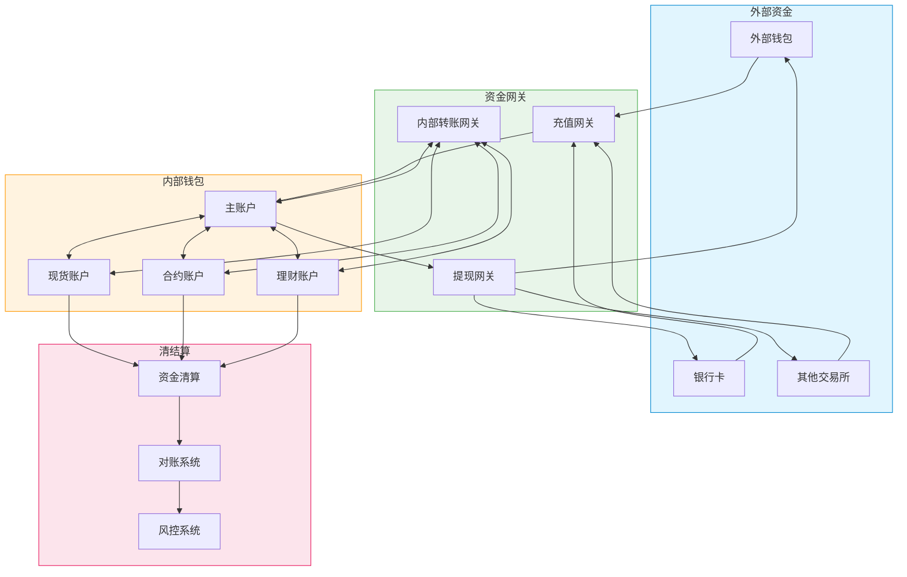

# 资金管理流程

## 1. 资金流转流程图


## 2. 数据库表设计

### 2.1 账户表
```sql
CREATE TABLE `accounts` (
    `id` BIGINT UNSIGNED NOT NULL AUTO_INCREMENT COMMENT '自增主键',
    `uid` VARCHAR(32) NOT NULL COMMENT '用户唯一标识',
    `account_no` VARCHAR(32) NOT NULL COMMENT '账户编号',
    `account_name` VARCHAR(64) NOT NULL COMMENT '账户名称',
    `account_type` TINYINT NOT NULL COMMENT '账户类型:1=主账户,2=现货,3=合约,4=理财',
    `status` TINYINT NOT NULL DEFAULT 1 COMMENT '状态:0=冻结,1=正常',
    `level` TINYINT NOT NULL DEFAULT 1 COMMENT '账户等级',
    `risk_level` TINYINT NOT NULL DEFAULT 0 COMMENT '风险等级',
    `created_at` DATETIME NOT NULL DEFAULT CURRENT_TIMESTAMP,
    `updated_at` DATETIME NOT NULL DEFAULT CURRENT_TIMESTAMP ON UPDATE CURRENT_TIMESTAMP,
    PRIMARY KEY (`id`),
    UNIQUE KEY `uk_account_no` (`account_no`),
    UNIQUE KEY `uk_uid_type` (`uid`, `account_type`),
    KEY `idx_uid` (`uid`),
    KEY `idx_status` (`status`)
) ENGINE=InnoDB DEFAULT CHARSET=utf8mb4 COMMENT='账户表';
```

### 2.2 账户余额表
```sql
CREATE TABLE `account_balances` (
    `id` BIGINT UNSIGNED NOT NULL AUTO_INCREMENT COMMENT '自增主键',
    `uid` VARCHAR(32) NOT NULL COMMENT '用户唯一标识',
    `account_no` VARCHAR(32) NOT NULL COMMENT '账户编号',
    `currency` VARCHAR(32) NOT NULL COMMENT '币种',
    `available` DECIMAL(32,8) NOT NULL DEFAULT 0 COMMENT '可用余额',
    `frozen` DECIMAL(32,8) NOT NULL DEFAULT 0 COMMENT '冻结余额',
    `total` DECIMAL(32,8) NOT NULL DEFAULT 0 COMMENT '总余额',
    `version` BIGINT NOT NULL DEFAULT 1 COMMENT '版本号',
    `updated_at` DATETIME NOT NULL DEFAULT CURRENT_TIMESTAMP ON UPDATE CURRENT_TIMESTAMP,
    PRIMARY KEY (`id`),
    UNIQUE KEY `uk_account_currency` (`account_no`, `currency`),
    KEY `idx_uid` (`uid`),
    KEY `idx_currency` (`currency`)
) ENGINE=InnoDB DEFAULT CHARSET=utf8mb4 COMMENT='账户余额表';
```

### 2.3 资金流水表
```sql
CREATE TABLE `account_transactions` (
    `id` BIGINT UNSIGNED NOT NULL AUTO_INCREMENT COMMENT '自增主键',
    `tx_id` VARCHAR(64) NOT NULL COMMENT '交易ID',
    `uid` VARCHAR(32) NOT NULL COMMENT '用户唯一标识',
    `account_no` VARCHAR(32) NOT NULL COMMENT '账户编号',
    `currency` VARCHAR(32) NOT NULL COMMENT '币种',
    `tx_type` TINYINT NOT NULL COMMENT '交易类型:1=充值,2=提现,3=转入,4=转出,5=冻结,6=解冻',
    `amount` DECIMAL(32,8) NOT NULL COMMENT '交易金额',
    `fee` DECIMAL(32,8) NOT NULL DEFAULT 0 COMMENT '手续费',
    `before_balance` DECIMAL(32,8) NOT NULL COMMENT '交易前余额',
    `after_balance` DECIMAL(32,8) NOT NULL COMMENT '交易后余额',
    `status` TINYINT NOT NULL COMMENT '状态:0=失败,1=成功,2=处理中',
    `ref_id` VARCHAR(64) DEFAULT NULL COMMENT '关联ID',
    `remark` VARCHAR(256) DEFAULT NULL COMMENT '备注',
    `created_at` DATETIME NOT NULL DEFAULT CURRENT_TIMESTAMP,
    `updated_at` DATETIME NOT NULL DEFAULT CURRENT_TIMESTAMP ON UPDATE CURRENT_TIMESTAMP,
    PRIMARY KEY (`id`),
    UNIQUE KEY `uk_tx_id` (`tx_id`),
    KEY `idx_uid` (`uid`),
    KEY `idx_account_no` (`account_no`),
    KEY `idx_ref_id` (`ref_id`),
    KEY `idx_created_at` (`created_at`)
) ENGINE=InnoDB DEFAULT CHARSET=utf8mb4 COMMENT='资金流水表';
```

### 2.4 充值记录表
```sql
CREATE TABLE `deposits` (
    `id` BIGINT UNSIGNED NOT NULL AUTO_INCREMENT COMMENT '自增主键',
    `deposit_id` VARCHAR(64) NOT NULL COMMENT '充值ID',
    `uid` VARCHAR(32) NOT NULL COMMENT '用户唯一标识',
    `account_no` VARCHAR(32) NOT NULL COMMENT '账户编号',
    `currency` VARCHAR(32) NOT NULL COMMENT '币种',
    `amount` DECIMAL(32,8) NOT NULL COMMENT '充值金额',
    `tx_hash` VARCHAR(128) DEFAULT NULL COMMENT '交易哈希',
    `address` VARCHAR(128) NOT NULL COMMENT '充值地址',
    `confirm_blocks` INT NOT NULL DEFAULT 0 COMMENT '确认区块数',
    `status` TINYINT NOT NULL DEFAULT 0 COMMENT '状态:0=待确认,1=已确认,2=已到账,3=已拒绝',
    `risk_level` TINYINT NOT NULL DEFAULT 0 COMMENT '风险等级',
    `created_at` DATETIME NOT NULL DEFAULT CURRENT_TIMESTAMP,
    `updated_at` DATETIME NOT NULL DEFAULT CURRENT_TIMESTAMP ON UPDATE CURRENT_TIMESTAMP,
    PRIMARY KEY (`id`),
    UNIQUE KEY `uk_deposit_id` (`deposit_id`),
    KEY `idx_uid` (`uid`),
    KEY `idx_tx_hash` (`tx_hash`),
    KEY `idx_status` (`status`)
) ENGINE=InnoDB DEFAULT CHARSET=utf8mb4 COMMENT='充值记录表';
```

### 2.5 提现记录表
```sql
CREATE TABLE `withdrawals` (
    `id` BIGINT UNSIGNED NOT NULL AUTO_INCREMENT COMMENT '自增主键',
    `withdrawal_id` VARCHAR(64) NOT NULL COMMENT '提现ID',
    `uid` VARCHAR(32) NOT NULL COMMENT '用户唯一标识',
    `account_no` VARCHAR(32) NOT NULL COMMENT '账户编号',
    `currency` VARCHAR(32) NOT NULL COMMENT '币种',
    `amount` DECIMAL(32,8) NOT NULL COMMENT '提现金额',
    `fee` DECIMAL(32,8) NOT NULL COMMENT '手续费',
    `address` VARCHAR(128) NOT NULL COMMENT '提现地址',
    `tx_hash` VARCHAR(128) DEFAULT NULL COMMENT '交易哈希',
    `status` TINYINT NOT NULL DEFAULT 0 COMMENT '状态:0=待审核,1=审核通过,2=处理中,3=已完成,4=已拒绝,5=已取消',
    `risk_level` TINYINT NOT NULL DEFAULT 0 COMMENT '风险等级',
    `verify_admin` VARCHAR(32) DEFAULT NULL COMMENT '审核人',
    `verify_time` DATETIME DEFAULT NULL COMMENT '审核时间',
    `verify_remark` VARCHAR(256) DEFAULT NULL COMMENT '审核备注',
    `created_at` DATETIME NOT NULL DEFAULT CURRENT_TIMESTAMP,
    `updated_at` DATETIME NOT NULL DEFAULT CURRENT_TIMESTAMP ON UPDATE CURRENT_TIMESTAMP,
    PRIMARY KEY (`id`),
    UNIQUE KEY `uk_withdrawal_id` (`withdrawal_id`),
    KEY `idx_uid` (`uid`),
    KEY `idx_tx_hash` (`tx_hash`),
    KEY `idx_status` (`status`)
) ENGINE=InnoDB DEFAULT CHARSET=utf8mb4 COMMENT='提现记录表';
```

## 3. 业务流程说明

### 3.1 充值流程
1. **地址分配**
   - 用户申请充值地址
   - 系统分配唯一地址
   - 记录地址归属关系

2. **充值确认**
   - 监控充值地址
   - 检测入账交易
   - 等待区块确认
   - 更新账户余额

3. **到账处理**
   - 生成内部流水
   - 更新充值状态
   - 通知用户到账

### 3.2 提现流程
1. **安全验证**
   - 身份验证
   - 2FA验证
   - 地址白名单验证
   - 额度检查

2. **风控审核**
   - 自动风控
   - 人工审核
   - 大额审批
   - 异常处理

3. **提现执行**
   - 冻结资金
   - 广播交易
   - 等待确认
   - 更新状态

### 3.3 内部转账
1. **账户间转账**
   - 验证账户关系
   - 检查余额
   - 执行转账
   - 记录流水

2. **批量转账**
   - 批次管理
   - 并发控制
   - 原子性保证
   - 异常回滚

## 4. 风控措施

### 4.1 交易风控
- 单笔限额控制
- 日累计限额
- 大额人工审核
- 异常行为检测

### 4.2 地址风控
- 地址白名单
- 黑名单校验
- 地址有效性验证
- 智能合约检测

### 4.3 安全风控
- 多重签名
- 冷热钱包分离
- 资金调度控制
- 异常监控预警

## 5. 对账清算

### 5.1 定时对账
- 余额对账
- 流水对账
- 区块对账
- 差错处理

### 5.2 清算流程
- 手续费清算
- 收益分配
- 快照备份
- 对账报告

## 6. 注意事项

### 6.1 性能要求
- 高并发处理
- 实时到账
- 秒级确认
- 批量处理

### 6.2 安全要求
- 资金安全
- 数据安全
- 操作安全
- 系统安全

### 6.3 合规要求
- 监管合规
- 审计要求
- 信息披露
- 风险控制