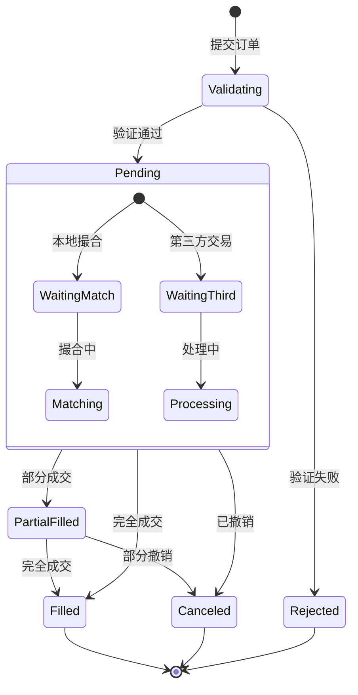
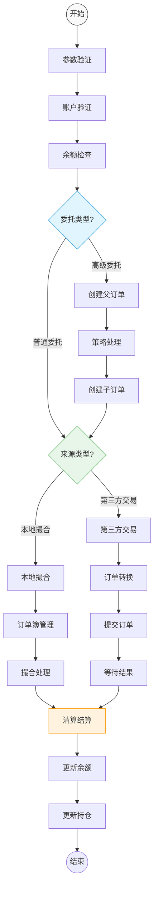

# 交易执行流程

## 1. 订单生命周期流程


## 2. 订单处理流程


## 3. 数据流转流程

```mermaid
flowchart LR
    subgraph Client[客户端]
        Web[Web端]
        App[App端]
        API[API]
    end

    subgraph Gateway[交易网关]
        Router[路由分发]
        Validator[参数验证]
        RateLimit[限流控制]
    end

    subgraph Engine[交易引擎]
        OrderManager[订单管理]
        MatchEngine[撮合引擎]
        RiskControl[风控系统]
    end

    subgraph ThirdParty[第三方交易]
        Converter[订单转换]
        Submitter[订单提交]
        Syncer[状态同步]
    end

    subgraph Storage[数据存储]
        OrderDB[(订单数据)]
        TradeDB[(成交数据)]
        BalanceDB[(账户数据)]
    end

    Client --> Gateway
    Gateway --> Engine
    Engine --> Storage
    Engine --> ThirdParty
    ThirdParty --> Storage

    style Client fill:#e1f5fe,stroke:#0288d1
    style Gateway fill:#e8f5e9,stroke:#4caf50
    style Engine fill:#fff3e0,stroke:#ff9800
    style ThirdParty fill:#f3e5f5,stroke:#9c27b0
    style Storage fill:#fce4ec,stroke:#e91e63
```


## 4. 业务流程说明

### 4.1 订单验证流程
1. **参数验证**
   - 检查订单基础参数(pair_code, price, amount等)
   - 验证委托类型(type_code)和订单时效(time_in_force)
   - 检查策略参数(strategy_params)
   - 验证触发条件(trigger_condition)

2. **账户验证**
   - 检查账户状态(accounts.status)
   - 验证交易权限
   - 检查第三方配置(user_third_party_configs)
   - 验证API权限

3. **余额验证**
   - 检查可用余额(account_balances.available)
   - 计算冻结金额
   - 验证保证金要求
   - 检查风险限额

### 4.2 订单处理流程
1. **普通委托处理**
   - 创建订单记录(orders)
   - 冻结资金(account_balances)
   - 根据source_type路由
   - 更新订单状态

2. **高级委托处理**
   - 解析策略参数
   - 创建父订单
   - 生成子订单(sub_orders)
   - 执行策略逻辑

3. **第三方交易处理**
   - 转换订单格式
   - 提交第三方平台
   - 同步订单状态
   - 处理回调通知

### 4.3 清算结算流程
1. **成交处理**
   - 记录成交明细(trades)
   - 更新订单状态(orders.status)
   - 计算手续费(trades.fee)
   - 更新成交金额

2. **资金处理**
   - 解冻资金
   - 更新可用余额
   - 更新冻结余额
   - 记录资金流水

3. **持仓处理**
   - 更新持仓数量(positions)
   - 计算持仓均价
   - 更新风险指标
   - 检查强平条件

## 5. 性能优化

### 5.1 系统优化
- 内存撮合
- 异步处理
- 批量处理
- 多级缓存

### 5.2 数据优化
- 分库分表
- 冷热分离
- 定期归档
- 索引优化

### 5.3 并发控制
- 乐观锁
- 分布式锁
- 队列处理
- 限流控制

## 6. 监控预警

### 6.1 系统监控
- 撮合延迟
- 队列积压
- 系统负载
- 资源使用

### 6.2 业务监控
- 订单量监控
- 成交量监控
- 持仓监控
- 风险监控

### 6.3 异常预警
- 价格异常
- 交易异常
- 系统异常
- 风控预警

### 2.11 第三方交易配置表
```sql
CREATE TABLE `third_party_configs` (
    `id` BIGINT UNSIGNED NOT NULL AUTO_INCREMENT COMMENT '自增主键',
    `provider_code` VARCHAR(32) NOT NULL COMMENT '供应商代码',
    `provider_name` VARCHAR(64) NOT NULL COMMENT '供应商名称',
    `api_config` JSON NOT NULL COMMENT '接口配置',
    `pair_mappings` JSON NOT NULL COMMENT '交易对映射',
    `status` TINYINT NOT NULL DEFAULT 1 COMMENT '状态:0=禁用,1=启用',
    `created_at` DATETIME NOT NULL DEFAULT CURRENT_TIMESTAMP,
    `updated_at` DATETIME NOT NULL DEFAULT CURRENT_TIMESTAMP ON UPDATE CURRENT_TIMESTAMP,
    PRIMARY KEY (`id`),
    UNIQUE KEY `uk_provider_code` (`provider_code`)
) ENGINE=InnoDB DEFAULT CHARSET=utf8mb4 COMMENT='第三方交易配置表';

CREATE TABLE `user_third_party_configs` (
    `id` BIGINT UNSIGNED NOT NULL AUTO_INCREMENT COMMENT '自增主键',
    `uid` VARCHAR(32) NOT NULL COMMENT '用户唯一标识',
    `provider_code` VARCHAR(32) NOT NULL COMMENT '供应商代码',
    `api_key` VARCHAR(128) NOT NULL COMMENT 'API Key',
    `api_secret` VARCHAR(256) NOT NULL COMMENT 'API Secret',
    `extra_params` JSON DEFAULT NULL COMMENT '额外参数',
    `status` TINYINT NOT NULL DEFAULT 1 COMMENT '状态:0=禁用,1=启用',
    `created_at` DATETIME NOT NULL DEFAULT CURRENT_TIMESTAMP,
    `updated_at` DATETIME NOT NULL DEFAULT CURRENT_TIMESTAMP ON UPDATE CURRENT_TIMESTAMP,
    PRIMARY KEY (`id`),
    UNIQUE KEY `uk_uid_provider` (`uid`, `provider_code`)
) ENGINE=InnoDB DEFAULT CHARSET=utf8mb4 COMMENT='用户第三方配置表';
```

配置示例：
```json
// 第三方交易配置
{
    "provider_code": "BINANCE",
    "api_config": {
        "api_url": "https://api.binance.com",
        "ws_url": "wss://stream.binance.com:9443/ws",
        "timeout_ms": 5000,
        "rate_limit": {
            "order_limit": 50,
            "order_interval_ms": 1000
        }
    },
    "pair_mappings": {
        "BTC_USDT": "BTCUSDT",
        "ETH_USDT": "ETHUSDT"
    }
}

// 用户第三方配置
{
    "extra_params": {
        "passphrase": "xxx",        // 额外的认证参数
        "ip_whitelist": ["1.2.3.4"],// IP白名单
        "permissions": ["TRADE"],    // API权限
        "test_mode": false          // 是否测试模式
    }
}
```