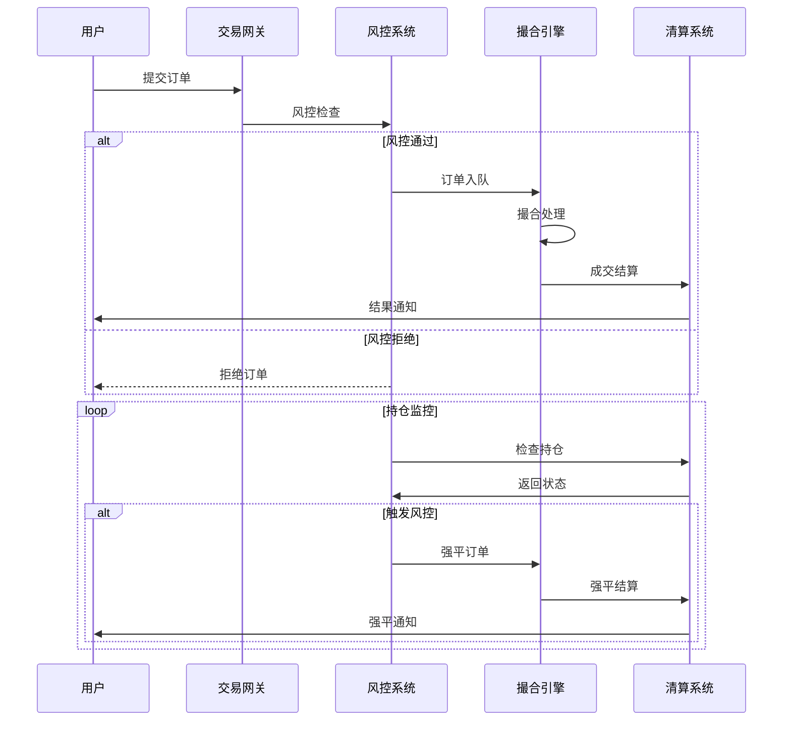

# 交易执行流程

## 1. 交易主流程


## 2. 数据库表设计

### 2.1 交易对配置表
```sql
CREATE TABLE `trading_pairs` (
    `id` BIGINT UNSIGNED NOT NULL AUTO_INCREMENT COMMENT '自增主键',
    `pair_code` VARCHAR(32) NOT NULL COMMENT '交易对代码',
    `base_currency` VARCHAR(32) NOT NULL COMMENT '基础币种',
    `quote_currency` VARCHAR(32) NOT NULL COMMENT '计价币种',
    `price_precision` TINYINT NOT NULL COMMENT '价格精度',
    `amount_precision` TINYINT NOT NULL COMMENT '数量精度',
    `min_amount` DECIMAL(32,8) NOT NULL COMMENT '最小交易量',
    `max_amount` DECIMAL(32,8) NOT NULL COMMENT '最大交易量',
    `min_price` DECIMAL(32,8) NOT NULL COMMENT '最小价格',
    `max_price` DECIMAL(32,8) NOT NULL COMMENT '最大价格',
    `status` TINYINT NOT NULL DEFAULT 1 COMMENT '状态:0=禁用,1=启用',
    `source_type` TINYINT NOT NULL DEFAULT 1 COMMENT '来源类型:1=本地撮合,2=三方交易',
    `created_at` DATETIME NOT NULL DEFAULT CURRENT_TIMESTAMP,
    `updated_at` DATETIME NOT NULL DEFAULT CURRENT_TIMESTAMP ON UPDATE CURRENT_TIMESTAMP,
    PRIMARY KEY (`id`),
    UNIQUE KEY `uk_pair_code` (`pair_code`)
) ENGINE=InnoDB DEFAULT CHARSET=utf8mb4 COMMENT='交易对配置表';

CREATE TABLE `market_data_sources` (
    `id` BIGINT UNSIGNED NOT NULL AUTO_INCREMENT COMMENT '自增主键',
    `source_code` VARCHAR(32) NOT NULL COMMENT '数据源代码',
    `source_name` VARCHAR(64) NOT NULL COMMENT '数据源名称',
    `source_type` TINYINT NOT NULL COMMENT '来源类型:1=实时行情,2=历史行情,3=模拟行情',
    `provider` VARCHAR(32) NOT NULL COMMENT '提供商:binance,okex,huobi等',
    `api_config` JSON NOT NULL COMMENT '接口配置',
    `status` TINYINT NOT NULL DEFAULT 1 COMMENT '状态:0=禁用,1=启用',
    `created_at` DATETIME NOT NULL DEFAULT CURRENT_TIMESTAMP,
    `updated_at` DATETIME NOT NULL DEFAULT CURRENT_TIMESTAMP ON UPDATE CURRENT_TIMESTAMP,
    PRIMARY KEY (`id`),
    UNIQUE KEY `uk_source_code` (`source_code`)
) ENGINE=InnoDB DEFAULT CHARSET=utf8mb4 COMMENT='行情数据源配置表';

CREATE TABLE `pair_data_source_maps` (
    `id` BIGINT UNSIGNED NOT NULL AUTO_INCREMENT COMMENT '自增主键',
    `pair_code` VARCHAR(32) NOT NULL COMMENT '交易对代码',
    `source_code` VARCHAR(32) NOT NULL COMMENT '数据源代码',
    `source_pair_code` VARCHAR(32) NOT NULL COMMENT '数据源交易对代码',
    `priority` INT NOT NULL DEFAULT 1 COMMENT '优先级:1-100,越小越优先',
    `status` TINYINT NOT NULL DEFAULT 1 COMMENT '状态:0=禁用,1=启用',
    `created_at` DATETIME NOT NULL DEFAULT CURRENT_TIMESTAMP,
    `updated_at` DATETIME NOT NULL DEFAULT CURRENT_TIMESTAMP ON UPDATE CURRENT_TIMESTAMP,
    PRIMARY KEY (`id`),
    UNIQUE KEY `uk_pair_source` (`pair_code`, `source_code`),
    KEY `idx_source_code` (`source_code`),
    KEY `idx_priority` (`priority`)
) ENGINE=InnoDB DEFAULT CHARSET=utf8mb4 COMMENT='交易对数据源映射表';
```

数据源配置示例：
```json
// 实时行情数据源
{
    "source_code": "BINANCE_SPOT",
    "api_config": {
        "ws_url": "wss://stream.binance.com:9443/ws",
        "rest_url": "https://api.binance.com",
        "api_key": "your_api_key",
        "secret_key": "your_secret_key",
        "symbols": ["BTCUSDT", "ETHUSDT"],
        "channels": ["ticker", "depth", "trade"],
        "depth_limit": 20,
        "update_speed": "100ms"
    }
}

// 模拟行情数据源
{
    "source_code": "LOCAL_MOCK",
    "api_config": {
        "base_price": 1000,
        "volatility": 0.001,
        "tick_interval": "100ms",
        "depth_size": 20,
        "depth_amount": "1.0",
        "trade_interval": "1s",
        "trade_amount": "0.01"
    }
}
```

### 2.2 订单表
```sql
CREATE TABLE `orders` (
    `id` BIGINT UNSIGNED NOT NULL AUTO_INCREMENT COMMENT '自增主键',
    `order_id` VARCHAR(64) NOT NULL COMMENT '订单ID',
    `uid` VARCHAR(32) NOT NULL COMMENT '用户唯一标识',
    `account_no` VARCHAR(32) NOT NULL COMMENT '账户编号',
    `pair_code` VARCHAR(32) NOT NULL COMMENT '交易对',
    `order_type` TINYINT NOT NULL COMMENT '订单类型:1=限价,2=市价',
    `side` TINYINT NOT NULL COMMENT '交易方向:1=买入,2=卖出',
    `price` DECIMAL(32,8) NOT NULL COMMENT '委托价格',
    `amount` DECIMAL(32,8) NOT NULL COMMENT '委托数量',
    `filled_amount` DECIMAL(32,8) NOT NULL DEFAULT 0 COMMENT '已成交数量',
    `filled_cash_amount` DECIMAL(32,8) NOT NULL DEFAULT 0 COMMENT '已成交金额',
    `filled_fee` DECIMAL(32,8) NOT NULL DEFAULT 0 COMMENT '已成交手续费',
    `status` TINYINT NOT NULL DEFAULT 0 COMMENT '状态:0=已提交,1=部分成交,2=完全成交,3=已撤销,4=拒绝',
    `source` VARCHAR(32) NOT NULL COMMENT '订单来源:web,api,app',
    `client_order_id` VARCHAR(64) DEFAULT NULL COMMENT '客户端订单ID',
    `created_at` DATETIME NOT NULL DEFAULT CURRENT_TIMESTAMP,
    `updated_at` DATETIME NOT NULL DEFAULT CURRENT_TIMESTAMP ON UPDATE CURRENT_TIMESTAMP,
    PRIMARY KEY (`id`),
    UNIQUE KEY `uk_order_id` (`order_id`),
    KEY `idx_uid` (`uid`),
    KEY `idx_account_no` (`account_no`),
    KEY `idx_pair_code` (`pair_code`),
    KEY `idx_status` (`status`),
    KEY `idx_created_at` (`created_at`)
) ENGINE=InnoDB DEFAULT CHARSET=utf8mb4 COMMENT='订单表';

ALTER TABLE `orders` 
ADD COLUMN `is_third_party` TINYINT NOT NULL DEFAULT 0 COMMENT '是否提交第三方:0=本地撮合,1=提交第三方' AFTER `source`,
ADD COLUMN `third_party_id` VARCHAR(64) DEFAULT NULL COMMENT '第三方订单ID' AFTER `is_third_party`,
ADD COLUMN `third_party_status` VARCHAR(32) DEFAULT NULL COMMENT '第三方订单状态' AFTER `third_party_id`,
ADD COLUMN `third_party_response` JSON DEFAULT NULL COMMENT '第三方返回信息' AFTER `third_party_status`,
ADD KEY `idx_third_party_id` (`third_party_id`);
```

### 2.3 成交记录表
```sql
CREATE TABLE `trades` (
    `id` BIGINT UNSIGNED NOT NULL AUTO_INCREMENT COMMENT '自增主键',
    `trade_id` VARCHAR(64) NOT NULL COMMENT '成交ID',
    `order_id` VARCHAR(64) NOT NULL COMMENT '订单ID',
    `uid` VARCHAR(32) NOT NULL COMMENT '用户唯一标识',
    `account_no` VARCHAR(32) NOT NULL COMMENT '账户编号',
    `pair_code` VARCHAR(32) NOT NULL COMMENT '交易对',
    `side` TINYINT NOT NULL COMMENT '交易方向:1=买入,2=卖出',
    `price` DECIMAL(32,8) NOT NULL COMMENT '成交价格',
    `amount` DECIMAL(32,8) NOT NULL COMMENT '成交数量',
    `cash_amount` DECIMAL(32,8) NOT NULL COMMENT '成交金额',
    `fee` DECIMAL(32,8) NOT NULL COMMENT '手续费',
    `fee_currency` VARCHAR(32) NOT NULL COMMENT '手续费币种',
    `role` TINYINT NOT NULL COMMENT '成交角色:1=Maker,2=Taker',
    `created_at` DATETIME NOT NULL DEFAULT CURRENT_TIMESTAMP,
    PRIMARY KEY (`id`),
    UNIQUE KEY `uk_trade_id` (`trade_id`),
    KEY `idx_order_id` (`order_id`),
    KEY `idx_uid` (`uid`),
    KEY `idx_account_no` (`account_no`),
    KEY `idx_pair_code` (`pair_code`),
    KEY `idx_created_at` (`created_at`)
) ENGINE=InnoDB DEFAULT CHARSET=utf8mb4 COMMENT='成交记录表';
```

### 2.4 持仓表
```sql
CREATE TABLE `positions` (
    `id` BIGINT UNSIGNED NOT NULL AUTO_INCREMENT COMMENT '自增主键',
    `uid` VARCHAR(32) NOT NULL COMMENT '用户唯一标识',
    `account_no` VARCHAR(32) NOT NULL COMMENT '账户编号',
    `pair_code` VARCHAR(32) NOT NULL COMMENT '交易对',
    `position_type` TINYINT NOT NULL COMMENT '持仓类型:1=多仓,2=空仓',
    `amount` DECIMAL(32,8) NOT NULL DEFAULT 0 COMMENT '持仓数量',
    `frozen_amount` DECIMAL(32,8) NOT NULL DEFAULT 0 COMMENT '冻结数量',
    `avg_price` DECIMAL(32,8) NOT NULL DEFAULT 0 COMMENT '平均价格',
    `liquidation_price` DECIMAL(32,8) DEFAULT NULL COMMENT '强平价格',
    `margin` DECIMAL(32,8) NOT NULL DEFAULT 0 COMMENT '保证金',
    `leverage` INT NOT NULL DEFAULT 1 COMMENT '杠杆倍数',
    `risk_level` TINYINT NOT NULL DEFAULT 0 COMMENT '风险等级',
    `created_at` DATETIME NOT NULL DEFAULT CURRENT_TIMESTAMP,
    `updated_at` DATETIME NOT NULL DEFAULT CURRENT_TIMESTAMP ON UPDATE CURRENT_TIMESTAMP,
    PRIMARY KEY (`id`),
    UNIQUE KEY `uk_account_pair_type` (`account_no`, `pair_code`, `position_type`),
    KEY `idx_uid` (`uid`),
    KEY `idx_pair_code` (`pair_code`),
    KEY `idx_risk_level` (`risk_level`)
) ENGINE=InnoDB DEFAULT CHARSET=utf8mb4 COMMENT='持仓表';
```

### 2.5 委托类型规则表
```sql
CREATE TABLE `order_type_rules` (
    `id` BIGINT UNSIGNED NOT NULL AUTO_INCREMENT COMMENT '自增主键',
    `type_code` VARCHAR(32) NOT NULL COMMENT '委托类型代码',
    `type_name` VARCHAR(64) NOT NULL COMMENT '委托类型名称',
    `category` TINYINT NOT NULL COMMENT '分类:1=现货,2=合约,3=期权',
    `order_type` TINYINT NOT NULL COMMENT '订单类型:1=限价,2=市价,3=止盈止损,4=冰山,5=时间加权,6=FOK,7=IOC',
    `time_in_force` VARCHAR(16) NOT NULL COMMENT '订单时效:GTC=永久,IOC=立即成交或取消,FOK=全部成交或取消,GTD=限期有效',
    `min_amount` DECIMAL(32,8) NOT NULL COMMENT '最小委托量',
    `max_amount` DECIMAL(32,8) NOT NULL COMMENT '最大委托量',
    `price_limit` DECIMAL(10,4) NOT NULL DEFAULT 0 COMMENT '价格偏离限制(%)',
    `trigger_condition` JSON DEFAULT NULL COMMENT '触发条件配置',
    `execution_strategy` JSON DEFAULT NULL COMMENT '执行策略配置',
    `risk_limit` JSON DEFAULT NULL COMMENT '风控限制配置',
    `fee_rules` JSON DEFAULT NULL COMMENT '手续费规则',
    `status` TINYINT NOT NULL DEFAULT 1 COMMENT '状态:0=禁用,1=启用',
    `created_at` DATETIME NOT NULL DEFAULT CURRENT_TIMESTAMP,
    `updated_at` DATETIME NOT NULL DEFAULT CURRENT_TIMESTAMP ON UPDATE CURRENT_TIMESTAMP,
    PRIMARY KEY (`id`),
    UNIQUE KEY `uk_type_code` (`type_code`),
    KEY `idx_category` (`category`),
    KEY `idx_order_type` (`order_type`),
    KEY `idx_status` (`status`)
) ENGINE=InnoDB DEFAULT CHARSET=utf8mb4 COMMENT='委托类型规则表';
```

### 2.6 委托类型配置示例
```json
// 止盈止损配置示例
{
    "type_code": "STOP_LIMIT",
    "trigger_condition": {
        "trigger_type": "PRICE",      // 触发类型：价格触发
        "trigger_price_type": "LAST",  // 触发价格类型：最新价
        "price_comparison": ">=",      // 价格比较：大于等于
        "trigger_price": "0",          // 触发价格（下单时指定）
        "extra_conditions": []         // 额外条件
    },
    "execution_strategy": {
        "order_type": "LIMIT",        // 执行订单类型：限价单
        "price_type": "FIXED",        // 价格类型：固定价格
        "price_offset": "0",          // 价格偏移
        "time_in_force": "GTC"        // 订单时效：永久有效
    },
    "risk_limit": {
        "price_limit_percent": 5,     // 价格偏离限制
        "min_amount": "0.001",        // 最小数量
        "max_amount": "1000"          // 最大数量
    }
}

// 冰山委托配置示例
{
    "type_code": "ICEBERG",
    "execution_strategy": {
        "display_size": "0",          // 显示数量（下单时指定）
        "variance_percent": 0.1,      // 随机波动比例
        "min_split_amount": "0.001",  // 最小拆分数量
        "price_limit": 0.1,           // 价格偏离限制
        "interval_ms": 1000           // 下单间隔(毫秒)
    },
    "risk_limit": {
        "max_sub_orders": 100,        // 最大子订单数
        "min_total_amount": "0.01",   // 最小总数量
        "max_total_amount": "1000"    // 最大总数量
    }
}

// 时间加权委托配置示例
{
    "type_code": "TWAP",
    "execution_strategy": {
        "total_duration_ms": 0,       // 总执行时间（下单时指定）
        "split_count": 0,             // 拆分次数（下单时指定）
        "price_type": "LAST",         // 价格类型：最新价
        "price_offset": "0",          // 价格偏移
        "variance_percent": 0.1       // 随机波动比例
    },
    "risk_limit": {
        "min_duration_ms": 60000,     // 最小执行时间
        "max_duration_ms": 86400000,  // 最大执行时间
        "min_split_count": 10,        // 最小拆分次数
        "max_split_count": 1000       // 最大拆分次数
    }
}
```

### 2.7 修改订单表
```sql
ALTER TABLE `orders` 
ADD COLUMN `type_code` VARCHAR(32) NOT NULL COMMENT '委托类型代码' AFTER `pair_code`,
ADD COLUMN `time_in_force` VARCHAR(16) NOT NULL DEFAULT 'GTC' COMMENT '订单时效' AFTER `order_type`,
ADD COLUMN `trigger_price` DECIMAL(32,8) DEFAULT NULL COMMENT '触发价格' AFTER `price`,
ADD COLUMN `strategy_params` JSON DEFAULT NULL COMMENT '策略参数' AFTER `client_order_id`,
ADD KEY `idx_type_code` (`type_code`);
```

### 2.8 子订单表
```sql
CREATE TABLE `sub_orders` (
    `id` BIGINT UNSIGNED NOT NULL AUTO_INCREMENT COMMENT '自增主键',
    `sub_order_id` VARCHAR(64) NOT NULL COMMENT '子订单ID',
    `parent_order_id` VARCHAR(64) NOT NULL COMMENT '父订单ID',
    `uid` VARCHAR(32) NOT NULL COMMENT '用户唯一标识',
    `account_no` VARCHAR(32) NOT NULL COMMENT '账户编号',
    `pair_code` VARCHAR(32) NOT NULL COMMENT '交易对',
    `order_type` TINYINT NOT NULL COMMENT '订单类型:1=限价,2=市价',
    `side` TINYINT NOT NULL COMMENT '交易方向:1=买入,2=卖出',
    `price` DECIMAL(32,8) NOT NULL COMMENT '委托价格',
    `amount` DECIMAL(32,8) NOT NULL COMMENT '委托数量',
    `filled_amount` DECIMAL(32,8) NOT NULL DEFAULT 0 COMMENT '已成交数量',
    `status` TINYINT NOT NULL DEFAULT 0 COMMENT '状态:0=已提交,1=部分成交,2=完全成交,3=已撤销,4=拒绝',
    `created_at` DATETIME NOT NULL DEFAULT CURRENT_TIMESTAMP,
    `updated_at` DATETIME NOT NULL DEFAULT CURRENT_TIMESTAMP ON UPDATE CURRENT_TIMESTAMP,
    PRIMARY KEY (`id`),
    UNIQUE KEY `uk_sub_order_id` (`sub_order_id`),
    KEY `idx_parent_order_id` (`parent_order_id`),
    KEY `idx_uid` (`uid`),
    KEY `idx_account_no` (`account_no`),
    KEY `idx_status` (`status`),
    KEY `idx_created_at` (`created_at`)
) ENGINE=InnoDB DEFAULT CHARSET=utf8mb4 COMMENT='子订单表';
```

### 2.9 委托条件规则表
```sql
CREATE TABLE `order_condition_rules` (
    `id` BIGINT UNSIGNED NOT NULL AUTO_INCREMENT COMMENT '自增主键',
    `rule_code` VARCHAR(32) NOT NULL COMMENT '规则代码',
    `rule_name` VARCHAR(64) NOT NULL COMMENT '规则名称',
    `type_code` VARCHAR(32) NOT NULL COMMENT '关联的委托类型',
    `rule_category` TINYINT NOT NULL COMMENT '规则分类:1=触发条件,2=执行策略,3=价格规则,4=数量规则',
    `rule_type` VARCHAR(32) NOT NULL COMMENT '规则类型:PRICE=价格,VOLUME=成交量,INDICATOR=指标,TIME=时间',
    `compare_type` VARCHAR(32) DEFAULT NULL COMMENT '比较类型:>,>=,<,<=,=,BETWEEN,CROSS_UP,CROSS_DOWN',
    `value_type` VARCHAR(32) NOT NULL COMMENT '值类型:NUMBER=数值,PERCENT=百分比,TIME=时间,PRICE=价格',
    `default_value` VARCHAR(64) DEFAULT NULL COMMENT '默认值',
    `min_value` VARCHAR(64) DEFAULT NULL COMMENT '最小值',
    `max_value` VARCHAR(64) DEFAULT NULL COMMENT '最大值',
    `step` VARCHAR(64) DEFAULT NULL COMMENT '步进值',
    `unit` VARCHAR(32) DEFAULT NULL COMMENT '单位',
    `params_template` JSON DEFAULT NULL COMMENT '参数模板',
    `description` VARCHAR(512) NOT NULL COMMENT '规则描述',
    `example` VARCHAR(512) DEFAULT NULL COMMENT '示例说明',
    `sort_order` INT NOT NULL DEFAULT 0 COMMENT '排序号',
    `status` TINYINT NOT NULL DEFAULT 1 COMMENT '状态:0=禁用,1=启用',
    `created_at` DATETIME NOT NULL DEFAULT CURRENT_TIMESTAMP,
    `updated_at` DATETIME NOT NULL DEFAULT CURRENT_TIMESTAMP ON UPDATE CURRENT_TIMESTAMP,
    PRIMARY KEY (`id`),
    UNIQUE KEY `uk_rule_code` (`rule_code`),
    KEY `idx_type_code` (`type_code`),
    KEY `idx_category` (`rule_category`),
    KEY `idx_status` (`status`)
) ENGINE=InnoDB DEFAULT CHARSET=utf8mb4 COMMENT='委托条件规则表';
```

### 2.10 条件规则配置示例
```json
// 价格触发条件规则
{
    "rule_code": "PRICE_TRIGGER",
    "rule_name": "价格触发",
    "type_code": "STOP_LIMIT",
    "rule_category": 1,
    "rule_type": "PRICE",
    "compare_type": ">=",
    "value_type": "PRICE",
    "params_template": {
        "price_type": {
            "type": "enum",
            "values": ["LAST", "BID", "ASK", "INDEX"],
            "default": "LAST",
            "description": "价格类型:最新价/买一价/卖一价/指数价"
        },
        "trigger_price": {
            "type": "price",
            "min": "0",
            "description": "触发价格"
        },
        "price_offset": {
            "type": "percent",
            "min": "-10",
            "max": "10",
            "default": "0",
            "description": "价格偏移百分比"
        }
    },
    "description": "当价格满足条件时触发委托",
    "example": "当最新价格>=1000时触发委托"
}

// 成交量触发条件规则
{
    "rule_code": "VOLUME_TRIGGER",
    "rule_name": "成交量触发",
    "type_code": "STOP_LIMIT",
    "rule_category": 1,
    "rule_type": "VOLUME",
    "compare_type": ">=",
    "value_type": "NUMBER",
    "params_template": {
        "volume_period": {
            "type": "enum",
            "values": ["1min", "5min", "15min", "30min", "1hour"],
            "default": "5min",
            "description": "成交量周期"
        },
        "volume_threshold": {
            "type": "number",
            "min": "0",
            "description": "成交量阈值"
        },
        "volume_type": {
            "type": "enum",
            "values": ["AMOUNT", "QUANTITY"],
            "default": "AMOUNT",
            "description": "成交量类型:成交额/成交量"
        }
    },
    "description": "当成交量满足条件时触发委托",
    "example": "当5分钟成交额>=100000时触发委托"
}

// 技术指标触发规则
{
    "rule_code": "MA_CROSS",
    "rule_name": "均线交叉",
    "type_code": "STOP_LIMIT",
    "rule_category": 1,
    "rule_type": "INDICATOR",
    "compare_type": "CROSS_UP",
    "value_type": "NUMBER",
    "params_template": {
        "ma_fast_period": {
            "type": "number",
            "min": "1",
            "max": "1000",
            "default": "5",
            "description": "快线周期"
        },
        "ma_slow_period": {
            "type": "number",
            "min": "1",
            "max": "1000",
            "default": "20",
            "description": "慢线周期"
        },
        "price_type": {
            "type": "enum",
            "values": ["CLOSE", "OPEN", "HIGH", "LOW"],
            "default": "CLOSE",
            "description": "计算价格类型"
        }
    },
    "description": "当快线向上穿越慢线时触发委托",
    "example": "当MA5向上穿越MA20时触发委托"
}

// 时间触发规则
{
    "rule_code": "TIME_TRIGGER",
    "rule_name": "定时触发",
    "type_code": "STOP_LIMIT",
    "rule_category": 1,
    "rule_type": "TIME",
    "compare_type": ">=",
    "value_type": "TIME",
    "params_template": {
        "trigger_time": {
            "type": "time",
            "description": "触发时间点"
        },
        "repeat_type": {
            "type": "enum",
            "values": ["ONCE", "DAILY", "WEEKLY"],
            "default": "ONCE",
            "description": "重复类型:一次/每天/每周"
        },
        "valid_days": {
            "type": "number",
            "min": "1",
            "max": "365",
            "default": "1",
            "description": "有效天数"
        }
    },
    "description": "在指定时间触发委托",
    "example": "每天09:30触发委托"
}

// 网格策略规则
{
    "rule_code": "GRID_STRATEGY",
    "rule_name": "网格策略",
    "type_code": "GRID",
    "rule_category": 2,
    "rule_type": "PRICE",
    "params_template": {
        "grid_type": {
            "type": "enum",
            "values": ["ARITHMETIC", "GEOMETRIC"],
            "default": "ARITHMETIC",
            "description": "网格类型:等差/等比"
        },
        "upper_price": {
            "type": "price",
            "min": "0",
            "description": "上边界价格"
        },
        "lower_price": {
            "type": "price",
            "min": "0",
            "description": "下边界价格"
        },
        "grid_count": {
            "type": "number",
            "min": "2",
            "max": "100",
            "description": "网格数量"
        },
        "invest_amount": {
            "type": "number",
            "min": "0",
            "description": "投资金额"
        }
    },
    "description": "在价格区间内设置网格自动交易",
    "example": "在8000-10000区间设置20个网格"
}
```

这些规则配置支持以下玩法：

1. **价格类触发**
   - 价格突破
   - 价格回调
   - 区间突破
   - 价格跟踪

2. **成交量类触发**
   - 放量突破
   - 缩量回调
   - 异常成交量
   - 累计成交量

3. **技术指标类触发**
   - 均线交叉
   - MACD金叉死叉
   - RSI超买超卖
   - 布林带突破

4. **时间类触发**
   - 定时委托
   - 周期委托
   - 日内定时
   - 有效期控制

5. **组合条件触发**
   - 多条件与
   - 多条件或
   - 条件排除
   - 条件优先级

6. **执行策略**
   - 网格交易
   - 冰山委托
   - 时间加权
   - 篮子委托

## 3. 业务流程说明

### 3.1 订单处理流程
1. **订单验证**
   - 参数校验
   - 余额检查
   - 交易对状态检查
   - 价格范围检查

2. **风控检查**
   - 交易权限检查
   - 持仓限额检查
   - 下单频率检查
   - 价格偏离检查

3. **订单撮合**
   - 订单簿管理
   - 价格优先级
   - 时间优先级
   - 部分成交处理

4. **清算结算**
   - 资金变动
   - 持仓更新
   - 手续费计算
   - 盈亏结算

### 3.2 风控管理
1. **交易限制**
   - 单笔限额
   - 日累计限额
   - 持仓限额
   - 杠杆限制

2. **价格控制**
   - 价格偏离度
   - 波动监控
   - 深度检查
   - 操纵预警

3. **账户控制**
   - 保证金率
   - 强平线管理
   - 风险度计算
   - 预警通知

### 3.3 异常处理
1. **订单异常**
   - 重复订单
   - 无效订单
   - 超时订单
   - 系统故障

2. **撮合异常**
   - 价格异常
   - 数量异常
   - 深度异常
   - 系统拥堵

3. **清算异常**
   - 余额不足
   - 持仓异常
   - 结算失败
   - 数据不一致

## 4. 性能优化

### 4.1 系统优化
- 内存撮合
- 异步处理
- 批量处理
- 多级缓存

### 4.2 数据优化
- 分库分表
- 冷热分离
- 定期归档
- 索引优化

### 4.3 并发控制
- 乐观锁
- 分布式锁
- 队列处理
- 限流控制

## 5. 监控预警

### 5.1 系统监控
- 撮合延迟
- 队列积压
- 系统负载
- 资源使用

### 5.2 业务监控
- 订单量监控
- 成交量监控
- 持仓监控
- 风险监控

### 5.3 异常预警
- 价格异常
- 交易异常
- 系统异常
- 风控预警

### 2.11 第三方交易配置表
```sql
CREATE TABLE `third_party_configs` (
    `id` BIGINT UNSIGNED NOT NULL AUTO_INCREMENT COMMENT '自增主键',
    `provider_code` VARCHAR(32) NOT NULL COMMENT '供应商代码',
    `provider_name` VARCHAR(64) NOT NULL COMMENT '供应商名称',
    `api_config` JSON NOT NULL COMMENT '接口配置',
    `pair_mappings` JSON NOT NULL COMMENT '交易对映射',
    `status` TINYINT NOT NULL DEFAULT 1 COMMENT '状态:0=禁用,1=启用',
    `created_at` DATETIME NOT NULL DEFAULT CURRENT_TIMESTAMP,
    `updated_at` DATETIME NOT NULL DEFAULT CURRENT_TIMESTAMP ON UPDATE CURRENT_TIMESTAMP,
    PRIMARY KEY (`id`),
    UNIQUE KEY `uk_provider_code` (`provider_code`)
) ENGINE=InnoDB DEFAULT CHARSET=utf8mb4 COMMENT='第三方交易配置表';

CREATE TABLE `user_third_party_configs` (
    `id` BIGINT UNSIGNED NOT NULL AUTO_INCREMENT COMMENT '自增主键',
    `uid` VARCHAR(32) NOT NULL COMMENT '用户唯一标识',
    `provider_code` VARCHAR(32) NOT NULL COMMENT '供应商代码',
    `api_key` VARCHAR(128) NOT NULL COMMENT 'API Key',
    `api_secret` VARCHAR(256) NOT NULL COMMENT 'API Secret',
    `extra_params` JSON DEFAULT NULL COMMENT '额外参数',
    `status` TINYINT NOT NULL DEFAULT 1 COMMENT '状态:0=禁用,1=启用',
    `created_at` DATETIME NOT NULL DEFAULT CURRENT_TIMESTAMP,
    `updated_at` DATETIME NOT NULL DEFAULT CURRENT_TIMESTAMP ON UPDATE CURRENT_TIMESTAMP,
    PRIMARY KEY (`id`),
    UNIQUE KEY `uk_uid_provider` (`uid`, `provider_code`)
) ENGINE=InnoDB DEFAULT CHARSET=utf8mb4 COMMENT='用户第三方配置表';
```

配置示例：
```json
// 第三方交易配置
{
    "provider_code": "BINANCE",
    "api_config": {
        "api_url": "https://api.binance.com",
        "ws_url": "wss://stream.binance.com:9443/ws",
        "timeout_ms": 5000,
        "rate_limit": {
            "order_limit": 50,
            "order_interval_ms": 1000
        }
    },
    "pair_mappings": {
        "BTC_USDT": "BTCUSDT",
        "ETH_USDT": "ETHUSDT"
    }
}

// 用户第三方配置
{
    "extra_params": {
        "passphrase": "xxx",        // 额外的认证参数
        "ip_whitelist": ["1.2.3.4"],// IP白名单
        "permissions": ["TRADE"],    // API权限
        "test_mode": false          // 是否测试模式
    }
}
```